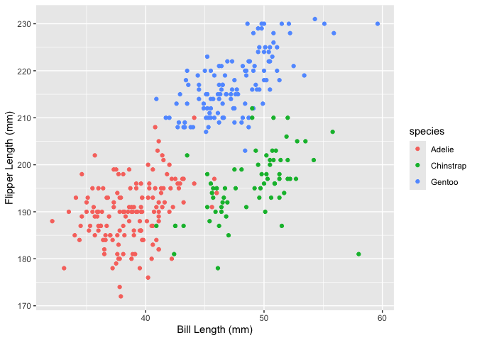

p8105_hw1_zc2822
================
Zhengyong Chen
2024-09-19

## Load the penguins dataset.

``` r
data("penguins", package = "palmerpenguins")
```

## Describe the penguins dataset.

``` r
variable_names = names(penguins)
species_names = levels(penguins$species)
island_names = levels(penguins$island)
bill_length_head10 = head(penguins$bill_length_mm, 10)
bill_depth_head10 = head(penguins$bill_depth_mm, 10)
flipper_length_head10 = head(penguins$flipper_length_mm, 10)
body_mass_head10 = head(penguins$body_mass_g, 10)

list("variable names" = variable_names,
     "species names" = species_names,
     "island names" = island_names,
     "head 10 of bill length" = bill_length_head10,
     "head 10 of bill depth" = bill_depth_head10,
     "head 10 of flipper length" = flipper_length_head10,
     "head 10 of body mass" = body_mass_head10)
```

    ## $`variable names`
    ## [1] "species"           "island"            "bill_length_mm"   
    ## [4] "bill_depth_mm"     "flipper_length_mm" "body_mass_g"      
    ## [7] "sex"               "year"             
    ## 
    ## $`species names`
    ## [1] "Adelie"    "Chinstrap" "Gentoo"   
    ## 
    ## $`island names`
    ## [1] "Biscoe"    "Dream"     "Torgersen"
    ## 
    ## $`head 10 of bill length`
    ##  [1] 39.1 39.5 40.3   NA 36.7 39.3 38.9 39.2 34.1 42.0
    ## 
    ## $`head 10 of bill depth`
    ##  [1] 18.7 17.4 18.0   NA 19.3 20.6 17.8 19.6 18.1 20.2
    ## 
    ## $`head 10 of flipper length`
    ##  [1] 181 186 195  NA 193 190 181 195 193 190
    ## 
    ## $`head 10 of body mass`
    ##  [1] 3750 3800 3250   NA 3450 3650 3625 4675 3475 4250

``` r
list("number of rows" = nrow(penguins),
     "number of columns" = ncol(penguins))
```

    ## $`number of rows`
    ## [1] 344
    ## 
    ## $`number of columns`
    ## [1] 8

``` r
mean_flipper_length = mean(penguins$flipper_length_mm, na.rm = TRUE)
cat("mean flipper length:", mean_flipper_length)
```

    ## mean flipper length: 200.9152

The data in the penguins dataset contains information about penguins,
includes their species(“Adelie”, “Chinstrap”, “Gentoo” ),
island(“Biscoe”, “Dream”, “Torgersen”), bill length, bill depth, flipper
length, bodu mass, sex, and year.

There are 8 variables and 344 observations.

The mean flipper length is 200.9152.

``` r
scatter_plot = ggplot(penguins, aes(x = bill_length_mm, y = flipper_length_mm, color = species)) +
                      geom_point() +
                      labs(x = "Bill Length (mm)", y = "Flipper Length (mm)")
                      
print(scatter_plot)
```

<!-- -->

``` r
ggsave("scatterplot_flipper_vs_bill.png", plot = scatter_plot)
```

    ## Saving 7 x 5 in image
